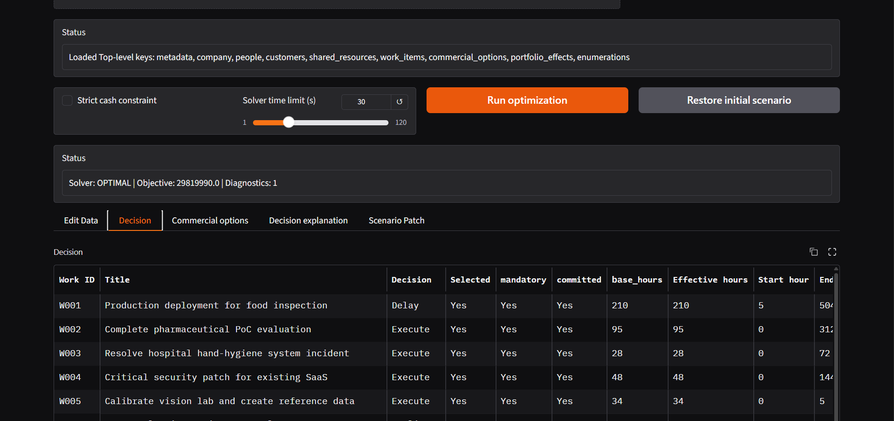
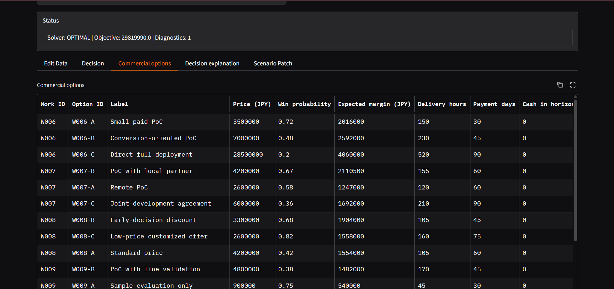
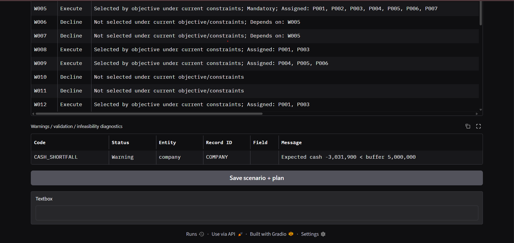
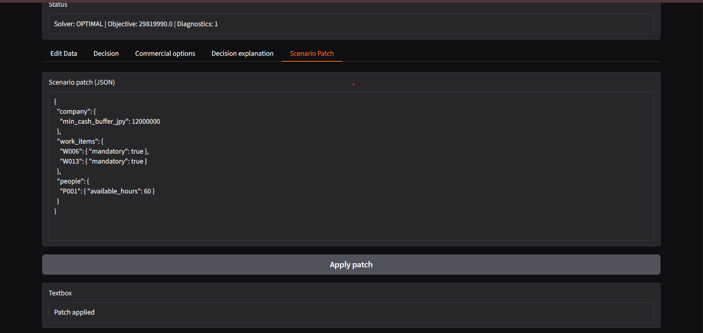
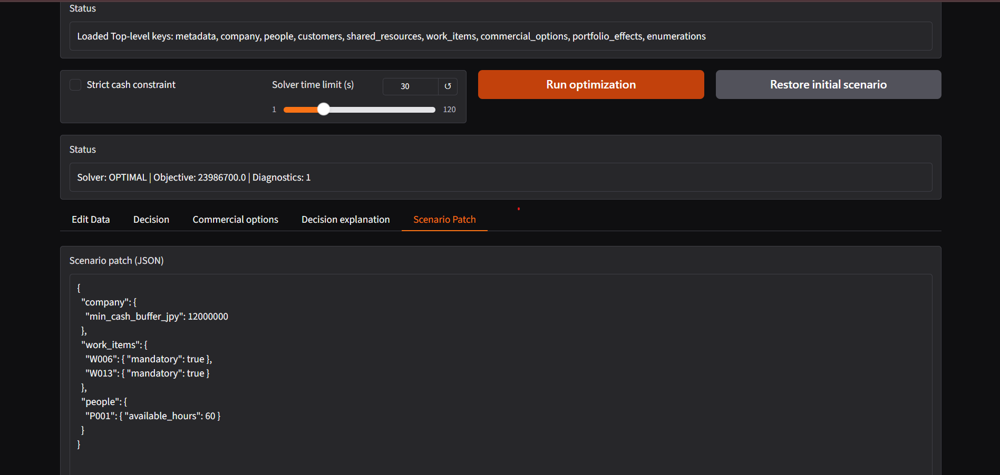
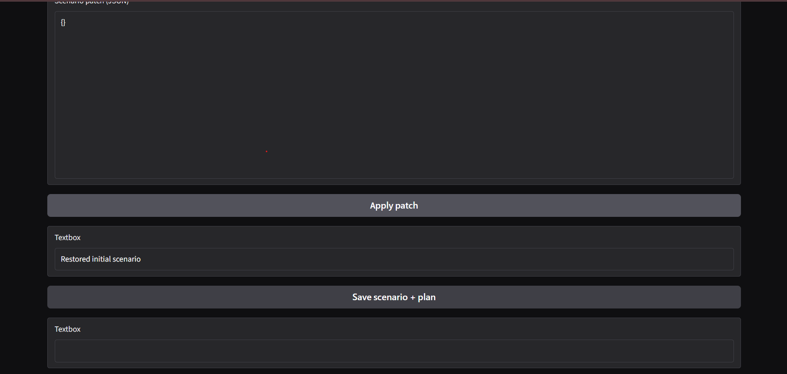
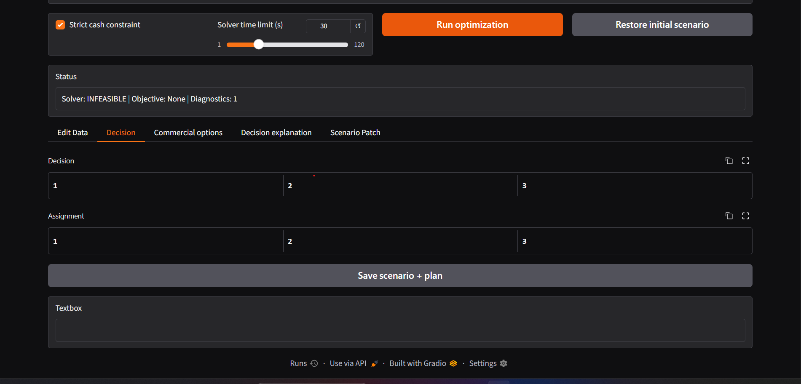

# Submission README — NexaWorks Product Development Challenge

## 1. Candidate and submission

- Candidate name: **Nguyen Tran Thien Phu**
- Application URL: **[Honda NexaWork](https://honda-nexawork.onrender.com)**
- Source repository or archive: **[Honda NexaWork](https://github.com/reality8080/Honda_NexaWork)**
- Evaluation login, if required: **Not required**
- Tested browser / operating system: **Not required**
- Commit or release identifier: **Not required**

## 2. Problem interpretation / 課題の理解

The primary user is a NexaWorks management/operations decision-maker. The application helps the user decide what work to execute, decline or delay, who should own it, when it should happen, which commercial option to offer, and how the plan should change after assumptions are modified.

The product treats the assignment as an integrated constrained planning problem rather than a static ranking. The intended workflow is:

`import/edit scenario → validate → optimize → inspect plan → inspect sales → inspect explanations/warnings → change assumptions → re-optimize → compare/save`

## 3. Objective and decision model / 目的関数・判断モデル

The main decision variables are work selection, start/end time, person-hour allocation, commercial-option selection and effective hours after portfolio effects.

The objective is a weighted utility built from:

```text
Expected margin
+ customer value
+ weighted future value
- risk penalty
- payment-delay penalty
- labor cost
- scheduling delay
- cash-shortfall penalty in baseline soft-cash mode
```

Hard operational constraints include mandatory work, person capacity, unavailable periods, skill/language coverage, earliest start/due dates, dependencies, conflicts, shared resources, commercial-option selection/dependencies and strict-cash mode.

Assignments and timing are chosen by OR-Tools CP-SAT. Commercial options are evaluated inside the integrated optimization rather than by a separate static ranking. No-bid/decline or delay is represented by not selecting the corresponding work/option.

Probabilities are interpreted as expected-value inputs, not guaranteed outcomes. The solver exposes its seed and status for reproducibility.

## 4. Main workflow / 主要な利用フロー

```text
candidate_dataset.json / uploaded JSON
        ↓
raw validation
        ↓
normalized data model
        ↓
semantic validation
        ↓
CP-SAT optimization
        ↓
result extraction
        ↓
post-check / infeasibility diagnostics
        ↓
Decision / Assignment / Sales / Explanation
        ↓
Scenario Patch / Restore initial scenario
        ↓
Re-optimize / compare / save
```

## 5. Architecture and technology / 技術構成

- Frontend: Gradio
- Backend: Python 3.11
- Database / persistence: JSON files; no external database
- Optimization or decision engine: OR-Tools CP-SAT
- Hosting / deployment: Hugging Face Spaces Docker, Docker, local VS Code
- Major libraries and licenses: Python (PSF); OR-Tools (Apache-2.0); NumPy (BSD-3-Clause); pandas (BSD-3-Clause); Gradio (Apache-2.0)
- External APIs: None required

## 6. Setup and operation / 起動・操作方法

### Local / VS Code

```powershell
py -3.11 -m venv .venv
.\.venv\Scripts\activate
python -m pip install --upgrade pip
pip install -r requirements.txt
python -m app.main
```

Then open `http://127.0.0.1:7860`.

Put the canonical `candidate_dataset.json` in `data/candidate_dataset.json`, or use the upload control.

### Docker

```powershell
docker build -t nexaworks .
docker run --rm -p 7860:7860 nexaworks
```

### Hugging Face Spaces

Create a **Docker Space**, upload the repository, keep `app_port: 7860`, and include `data/candidate_dataset.json` for the default-load path.

No environment variable or evaluation credential is required for the current implementation.

## 7. Testing / テスト

Automated tests cover:

- missing-field validation;
- skill-coverage validation;
- normal solver execution;
- strict-cash infeasibility;
- reproducibility with a fixed seed;
- increased record counts without relying on a specific existing work-item ID.

Manual final checks should include invalid input, alternate-schema import, changed assumptions, infeasible plan, strict cash, long text and the three supported interface languages.

## 8. Japanese, English and Vietnamese support / 三言語対応

The UI provides a language selector for English, Vietnamese and Japanese. Major controls, status labels and core workflow labels are localized. The dataset model preserves multilingual source fields.

Before final submission, dynamic solver reasons, warnings and long Vietnamese strings should be reviewed on the deployed Space; this is a release-quality check required by the assignment rather than an assumption of perfect machine translation.

## 9. UI/UX and design rationale / デザインの意図

The main screen prioritizes decision-changing controls and results. Decision, Sales and Explain are separated so that the evaluator can move from the plan to commercial reasoning and then to warnings/explanations.

The scenario workflow separates the original dataset from the mutable scenario. `Restore initial scenario` returns the current scenario to the initially loaded dataset. The application was refactored from notebook state into reusable package functions, removing notebook globals and display-only code.

## 10. AI and external-tool disclosure / AI・外部ツール利用

- Tool or service: **OpenAI ChatGPT**
- Used for: architecture review, notebook-to-package refactoring guidance, debugging, README drafting and Docker/Hugging Face packaging.
- Output accepted, rejected or changed: suggestions were adapted into the repository; the core mathematical model follows the notebook, while validation, diagnostics, deployment and application wiring were reviewed and modified for the target runtime.
- Verification: source inspection, Python compilation, application-level local testing, and cross-checking against the challenge requirements.

No external API is required by the application.

## 11. Important assumptions / 重要な仮定

1. One calendar day = 24 planning hours.
2. `mandatory=True` is hard; `committed` is a signal, not automatically hard.
3. Cash buffer is soft in baseline mode and hard in strict-cash mode.
4. Probabilities are expected-value estimates.
5. Objective weights are model assumptions stored in `nexaworks/config.py`.
6. Exact intra-horizon cash timestamps are not inferred beyond the dataset information.
7. Portfolio effects are applied only when represented by the supported input structure.

## 12. Known limitations and failure cases / 既知の制約・誤判断の可能性

1. Expected-value optimization does not fully represent distributional uncertainty or downside risk.
2. The current time model does not natively represent business calendars, weekends or time-zone-specific working rules unless modeled explicitly.
3. Infeasibility diagnostics identify common blockers but do not guarantee a unique minimal conflicting-constraint explanation for every infeasible CP-SAT model.
4. JSON persistence in a hosted container is not a durable multi-user database.
5. Multilingual wording still requires final human terminology review.

## 13. Security, privacy and data handling / セキュリティ・データ取扱い

No authentication or secret is required. Data is processed in the application runtime. Saved scenario/plan files are written to local `outputs/` when requested. No external API is used by the decision engine.

Do not put confidential customer information into a public evaluation Space. No private credentials should be committed to the repository.

## 14. One more day / あと1日あれば

The highest-value improvement would be a stronger infeasibility/sensitivity analysis: identify active blocking constraints more precisely, compare alternative feasible plans, and show which assumption changes most strongly affect selections, assignments, cash and deadlines.

## 15. Screenshots

Screenshots are located in `submit_screen/`:

| File | Content |
|------|---------|
| `01_decision_baseline.png` | Main decision screen (baseline OPTIMAL, Objective 29819990.0) |
| `02_sales_baseline.png` | Commercial options comparison |
| `03_explanation_warnings.png` | Decision reasons + CASH_SHORTFALL warning |
| `04a_scenario_patch_applied.png` | Strong patch applied (company / work_items / people) |
| `04b_after_patch_run.png` | Re-run after patch (Objective changed to 23986700.0) |
| `04c_restore_initial.png` | Restore initial scenario confirmation |
| `05_strict_cash_infeasible.png` | Strict-cash mode → INFEASIBLE |


Screenshots are located in `submit_screen/ScreenShot/`.

### 01. Decision baseline


### 02. Sales baseline


### 03. Explanation & Warnings


### 04a. Scenario patch applied


### 04b. After patch run


### 04c. Restore initial scenario


### 05. Strict-cash infeasible

